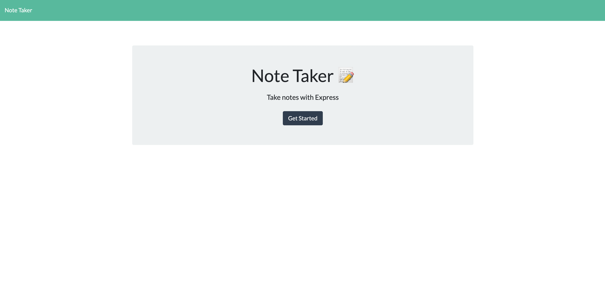
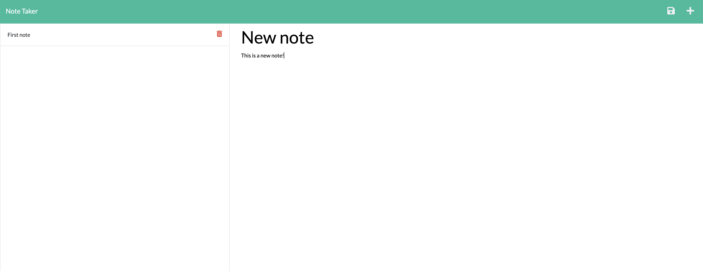

# Note Taker
  
  ## Contents
  
  * [Description](#description)
  * [Installation](#installation)
  * [Usage](#usage)  
  * [Contributions](#contributions)
  * [Questions](#questions)
    
  ## [Description](#Contents)
  
  This application was made using Node.js and Express.js along with HTML and CSS to create a note taking application. It offers the ability to add new notes, view notes, and delete them as desired.
  
  ## [Installation](#Contents)
  
  On the home page, click the "Get Started" button to start adding notes. Click on fields to add notes. To save, click the save button in the top right corner of the application, and the saved note will appear in the left hand column of the page. To view a saved note, simply click on the title. The trash can icon is to be used to permanently delete a selected note. To add a new note at any time, click the pencil icon in the top right corner. To get started, click the link below!

  [Note Taker](https://c11-note-taker-app.herokuapp.com/)
  
  ## [Usage](#Contents)
  
  This application can be used to save and take notes to organize your thoughts and keep track of tasks you need to complete!

  
  
  
  For more information on Markdown syntax and how to add screenshots, visit the following website:
  
  [Markdown Guide](https://www.markdownguide.org/)
  
       
  ## [Contributions](#Contents)
  
  Thank you for your interest in assisting with my project! At this time, I will not be accepting contributions.
  
  
  ## [Questions](#Contents)
  
  You can contact me by clicking the following links!
  
  [Email: caseynlister@gmail.com](mailto:caseynlister@gmail.com)
  
  [GitHub](https://github.com/caseylister)